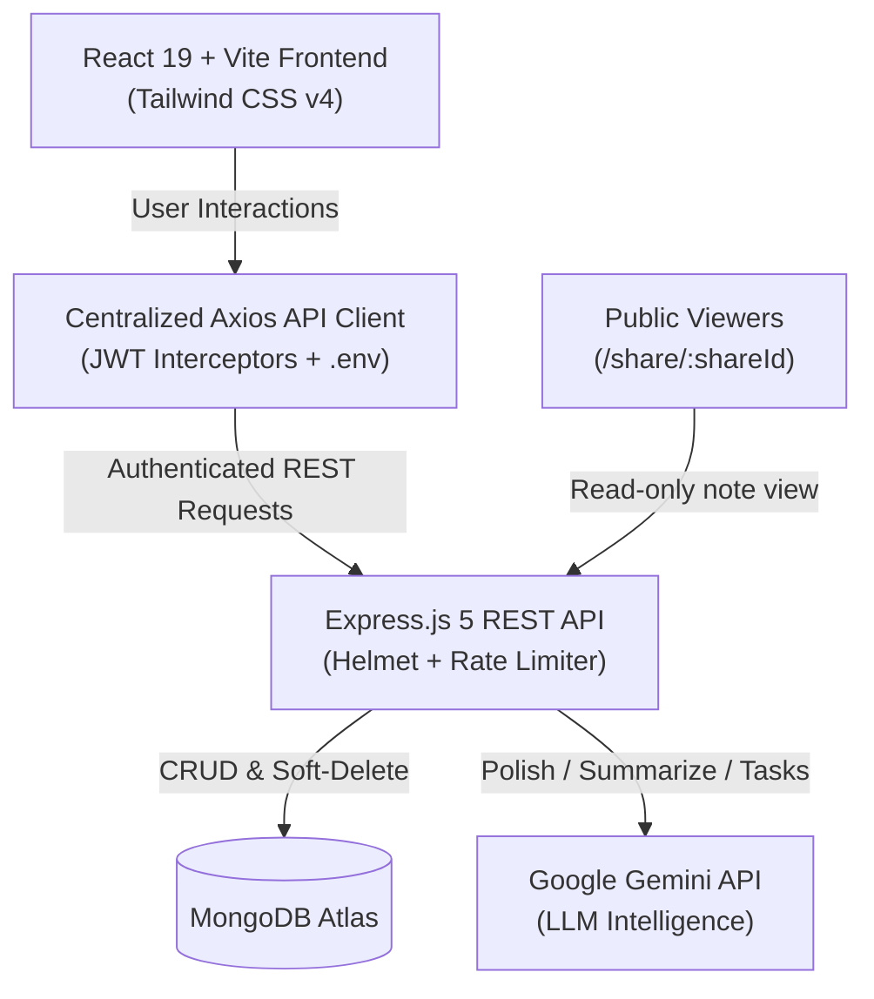

# ⚡ NoteApp — Modern AI-Powered Full-Stack MERN SaaS

> A state-of-the-art, 2026-ready note-taking platform featuring **AI Note Polishing & Summarization (Google Gemini)**, **Live Voice-to-Text Dictation**, **Markdown & Checklist Rendering**, **Public Share Links**, **Soft-Delete Trash System**, and **Enterprise Security**.

---

## 🚀 Live Demo & Links
- 🌐 **Frontend (Live on Vercel)**: [note-app-iota-weld.vercel.app](https://note-app-iota-weld.vercel.app/)
- ⚙️ **Backend (Live on Render)**: [noteapp-7afd.onrender.com](https://noteapp-7afd.onrender.com)
- 📦 **Monorepo**: Unified Full-Stack Architecture (`Dubey411/NoteApp`)

---

## ✨ Standout Features

| Feature | Description |
| :--- | :--- |
| 🪄 **AI Note Polish** | Uses Google Gemini to re-structure rough, chaotic thoughts into clean bullet points with headings. |
| 📝 **AI Summarizer** | Generates an executive 2-3 sentence summary of any note with a single click. |
| ✅ **AI Task Extractor** | Automatically identifies action items from note text and converts them into Markdown checklists (`- [ ]`). |
| 🎙️ **Voice Dictation** | Real-time speech-to-text dictation powered by the browser's native Web Speech API (zero latency, hands-free). |
| 📑 **Markdown & GFM** | Notes render rich text, code blocks, bold/italics, and interactive checklists via `react-markdown` + `remark-gfm`. |
| 🔗 **Public Share Links** | Generate unique shareable URLs (`/share/:shareId`) so anyone can read notes without having an account. |
| 📌 **Pin & Star Notes** | Keep critical notes sticky at the very top of your dashboard. |
| 🗑️ **Soft-Delete Trash Can** | Avoid accidental data loss. Move notes to Trash, restore them with one click, or permanently purge. |
| 🛡️ **Enterprise Security** | Production-ready HTTP security headers with `helmet`, IP rate-limiting with `express-rate-limit`, and JWT auth. |
| 🌙 **Dynamic Theme & Vibe** | Dark mode toggle, customized color themes with glow effects, and interactive animations. |

---

## 🏗️ Architecture Overview



---

## 🛠️ Tech Stack

### Frontend
- **Framework**: React 19, Vite 7
- **Styling**: Tailwind CSS v4, Lucide React icons
- **Rich Text**: `react-markdown`, `remark-gfm`
- **Routing**: `react-router-dom` v7
- **Networking**: Axios (with centralized Bearer token interceptor)
- **Feedback**: SweetAlert2, React-Toastify, Canvas Confetti

### Backend
- **Runtime**: Node.js v24+, Express.js 5
- **Database**: MongoDB with Mongoose 8
- **Authentication**: JSON Web Tokens (JWT), Bcrypt password hashing
- **AI Engine**: Google Gemini REST API (with offline smart fallback)
- **Security**: Helmet, Express Rate Limit, CORS configuration

---

## 📡 API Endpoints

### 🔐 Authentication (`/api/auth`)
- `POST /api/auth/signup` — Register a new account
- `POST /api/auth/login` — Authenticate and receive JWT
- `POST /api/auth/google-login` — Google OAuth token exchange

### 📝 Notes (`/api/notes`)
- `GET /api/notes` — Fetch all active notes (excludes trash, sorted by pinned & updated date)
- `POST /api/notes` — Create a new note
- `GET /api/notes/:id` — Get single note by ID
- `PUT /api/notes/:id` — Update note content, tags, color, etc.
- `PUT /api/notes/:id/pin` — Toggle pin status
- `PUT /api/notes/:id/trash` — Move note to Trash or restore
- `PUT /api/notes/:id/share` — Toggle public sharing and generate `shareId`
- `GET /api/notes/trash` — Fetch user's trashed notes
- `DELETE /api/notes/:id/permanent` — Permanently delete note forever
- `GET /api/notes/public/:shareId` — **Public route**: Read-only view for shared links

### 🤖 AI Services (`/api/ai`)
- `POST /api/ai/polish` — AI reformatting and structuring
- `POST /api/ai/summarize` — 2-3 sentence executive note summary
- `POST /api/ai/extract-tasks` — Extract markdown checklist of actionable to-dos

---

## 💻 Local Development Setup

### 1. Clone & install dependencies
```bash
git clone https://github.com/Dubey411/NoteApp.git
cd NoteApp

# Install backend dependencies
cd backend
npm install

# Install frontend dependencies
cd ../frontend
npm install
```

### 2. Configure Environment Variables

**In `backend/.env`**:
```env
MONGO_URI=your_mongodb_connection_string
JWT_SECRET=your_jwt_secret_key
GEMINI_API_KEY=your_optional_free_gemini_key
PORT=5000
```

**In `frontend/.env`**:
```env
VITE_API_URL=http://localhost:5000
```

### 3. Run Locally
In terminal 1 (Backend):
```bash
cd backend
npm run dev
```

In terminal 2 (Frontend):
```bash
cd frontend
npm run dev
```

---

## 🚢 Deployment Guide

### Deploy Backend to Render
1. Connect this repo to Render.
2. Set **Root Directory** to `backend`.
3. Build command: `npm install`
4. Start command: `npm start`
5. Add environment variables (`MONGO_URI`, `JWT_SECRET`, `GEMINI_API_KEY`).

### Deploy Frontend to Vercel
1. Import this repo into Vercel.
2. Set **Root Directory** to `frontend`.
3. Preset: **Vite** (Build: `npm run build`, Output: `dist`).
4. Add environment variable: `VITE_API_URL = https://your-backend.onrender.com`.
5. Deploy!

---

## 📜 License
ISC License © 2026 Dubey411
